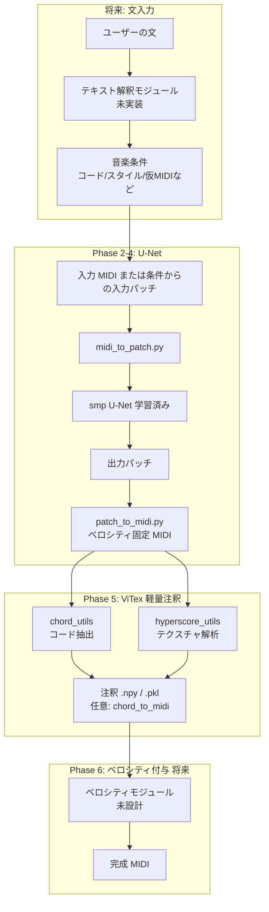
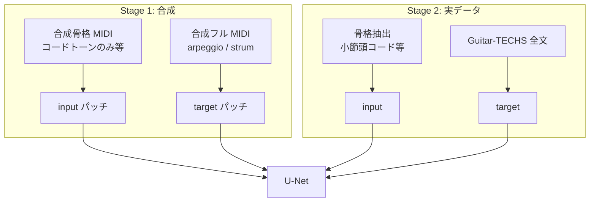
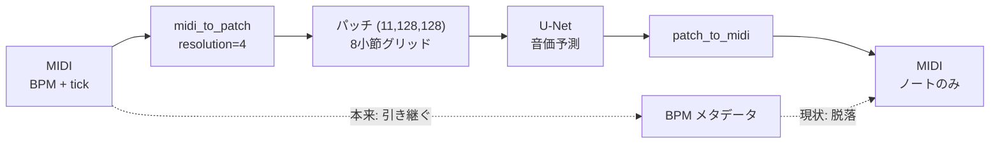
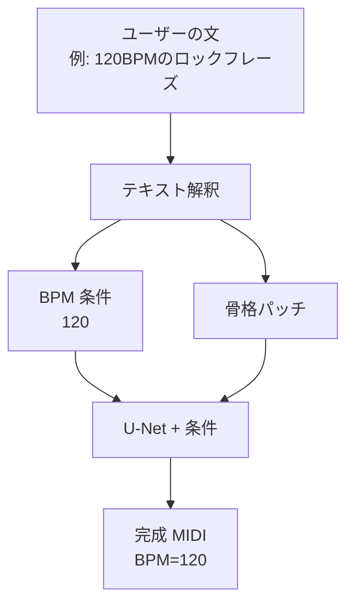

# 実装ロードマップ：文入力からの曲生成（U-Net + ViTex）

> 最終目標：**ユーザーの文（テキスト）入力から曲を生成する**  
> **主軸アーキテクチャ（2025 方針）**  
> 1. **smp U-Net** … 音高・タイミング・楽器構成の MIDI 骨格を生成（ベロシティは一旦固定）  
> 2. **ViTex 軽量層** … 生成 MIDI からコード・hyperscore を**逆算**し、曲に合った音楽符号を付与（**D3PM は使わない**）  
> 3. **ベロシティ付与** … 別フェーズで後から取り込む（構造は後述）  
> **学習方針（確定）** … **二段階学習**（合成データ → Guitar-TECHS ファインチューニング）。詳細は [§11](#11-学習方針二段階学習--データセット構成)。  
> **BPM / テンポ** … パッチは拍位置のみ保持、BPM はメタデータとして別管理。詳細は [§12](#12-bpm--テンポの実装とロードマップ)。

関連ドキュメント:

- [smp-unet-plan.md](./smp-unet-plan.md) … smp U-Net 導入の技術プラン
- [project-summary-slides.md](./project-summary-slides.md) … 現状サマリー（スライド用）
- [colab-training-slides.md](./colab-training-slides.md) … Colab 学習 & データセット（スライド用）

---

## 1. 最終的なシステム像



### 各コンポーネントの役割

| コンポーネント | 役割 | 現状 |
|---|---|---|
| **テキスト解釈** | 文 → コード進行・スタイル・仮 MIDI など | 未実装 |
| **smp U-Net** | 入力パッチ → 出力パッチ（音高・タイミング・楽器構成） | 雛形のみ |
| **patch_to_midi** | パッチ → MIDI（**ベロシティ固定**） | 実装済み（velocity=80） |
| **ViTex 軽量層** | 生成 MIDI からコード・hyperscore を抽出し符号付与 | 未着手（Phase 5） |
| **ベロシティ付与** | 強弱の付与（別モジュール） | 未着手（Phase 6） |
| **ViTex D3PM** | 拡散モデルによる再生成 | **主軸外**（必要なら将来オプション） |

### 主軸パイプライン（速度と役割分担）

```
入力 MIDI → U-Net → 骨格 MIDI（velocity 固定）
                    ↓
              ViTex 解析のみ（軽い・CPU）
              ・コード進行
              ・hyperscore（小節×テクスチャ）
                    ↓
              [将来] ベロシティ付与
                    ↓
              完成 MIDI + 注釈
```

**速度**: 生成の本体は U-Net のみ。ViTex は解析だけなので D3PM 比で桁違いに速い。U-Net 単体比では注釈分だけ +α。

### ViTex のベロシティについて（Phase 6 向けメモ）

ViTex の `output_utils.py` のベロシティは **AI 推定ではなく書き出し時の固定値** です。

| ViTex 関数 | ベロシティ |
|---|---|
| `multitrack_pianoroll_to_midi` | 100 固定（tonal / drum） |
| `pianoroll_to_midi` | 64 固定 |
| `chord_to_midi` | 80 固定 |

Phase 6 では **本格的な強弱推定**（小モデル・ルール・学習データ由来など）を別途設計する。当面の骨格段階では固定 velocity で問題ない。

---

## 2. 学習の考え方（正解 / 不正解ではない）

U-Net の学習は **「正解パターンと不正解パターンの判別」ではありません**。

```
入力パッチ（例: メロディのみ）
    ↓  U-Net
予測パッチ
    ↓  正解パッチと比較（MSE 損失）
誤差を小さくする方向に学習
```

- **必要なもの**: 入力パッチと正解パッチの **ペア**
- **不要なもの**: わざわざ「不正解」サンプル
- **推論時**: 学習時に見なかった **新しい入力** から **新しい MIDI** を生成

---

## 3. 現在地（2025 時点）

| 項目 | 状態 |
|---|---|
| MIDI → パッチ変換 | ✅ `midi_to_patch.py` |
| パッチ → MIDI 逆変換 | ✅ `patch_to_midi.py`（velocity=80 固定） |
| smp U-Net 組み込み | ✅ `model.py` |
| 学習雛形 | ✅ `train.py`（過学習テストまで確認） |
| 推論パイプライン | ✅ `inference.py` |
| **BPM / テンポ引き継ぎ** | ❌ 未実装（[§12](#12-bpm--テンポの実装とロードマップ)） |
| パッチ可視化 | ✅ `patch_to_image.py` / `.ipynb` |
| **本学習用データ** | ⚠️ 骨格→フルペアは未整備（§10-7） |
| **ViTex 統合** | ❌ 未着手 |
| **文入力** | ❌ 未着手 |

---

## 4. フェーズ別 実装手順

---

### Phase 0: 環境・動作確認（完了済み）

**目的**: パイプラインの骨格が動くことを確認する。

```powershell
cd prttype
python smoke_test_smp.py
python midi_to_patch.py
python patch_to_midi.py
```

**完了条件**

- [x] smp U-Net の forward が通る
- [x] `test1.mid` → パッチ → MIDI の往復ができる
- [x] `train.py --overfit-single` でチェックポイントが保存される

---

### Phase 1: 生成タスクの定義

**目的**: 「何を入力にして、何を出力させるか」を決める。

#### 1-1. タスクを 1 つに絞る（推奨）

最初は **ギター 1 スタイル** に限定する。

| 候補タスク | 入力 | 正解（出力） |
|---|---|---|
| A. フレーズ拡張 | 短いギター MIDI | 装飾・余韻付きギター MIDI |
| B. メロディ付加 | メロディのみ MIDI | メロディ + ギター伴奏 MIDI |
| C. 同一曲の別トラック | ギター単体 | ミックスから抽出したギター（難） |

**推奨**: まず **A または同一ギター MIDI の自己再構成**（入力=正解でパイプライン確認後、別バージョンに拡張）

#### 1-2. 入出力の単位を決める

- パッチ単位: **8 小節 = 128 tick**（現行の `midi_to_patch.py` に合わせる）
- 使用チャンネル: **tonal `(11, 128, 128)`**（ドラムは後回しでも可）

#### 1-3. 成果物

- [ ] タスク定義を 1 文で書く（例: 「入力ギター MIDI から、特徴的なリードギターフレーズ MIDI を生成する」）
- [ ] 入力・正解の具体例を 3 曲分以上リストアップする

#### 1-4. 暫定タスク（現状）

| 項目 | 内容 |
|---|---|
| 入力 | 発音点のみ（`prepare_dataset.py --mode onset_to_full`） |
| 正解 | 音価付きパッチ（Guitar-TECHS 等） |
| 位置づけ | パイプライン検証用。**最終タスクとして確定ではない** |

**本番の骨格設計** → [§10 今後の課題：U-Net 骨格（入力）設計](#10-今後の課題u-net-骨格入力設計) を参照。

---

### Phase 2: MIDI データセットの収集・整理

**目的**: 学習に使えるギター MIDI を集める。

#### 2-1. データソースの優先順位

| 優先度 | ソース | 形式 | 備考 |
|---|---|---|---|
| ★★★ | [Guitar-TECHS](https://zenodo.org/records/14963133) | `.mid`（弦ごと） | そのまま使いやすい |
| ★★☆ | [GuitarSet](https://zenodo.org/records/3371780) | JAMS（要変換） | 質が高い |
| ★★☆ | [SynthTab](https://synthtab.dev/) | MIDI 大量 | 合成データ |
| ★☆☆ | BitMidi 等 | `.mid` | 手動収集、品質バラバラ |

#### 2-2. データ量の目安

| 段階 | フレーズ数 | 目的 |
|---|---|---|
| 試験 | 100〜200 | 学習ループの確認 |
| プロトタイプ | 500〜2,000 | ギターらしさの確認 |
| 本番 | 3,000〜10,000 | 特徴的フレーズの安定生成 |

#### 2-3. 前処理チェックリスト

- [x] ギター MIDI の program を **27（category 3）** に統一（`remap_guitar_programs.py`・方針 B）
- [ ] ピアノ等・他楽器 MIDI 取り込み時は category / program 方針を別途決める
- [ ] テンポ・拍子を確認（resolution=4 に正規化は `midi_to_patch.py` が実施）
- [ ] 音符がほとんどないパッチは除外する
- [ ] 著作権・利用規約を確認する

#### 2-4. ディレクトリ構成（推奨）

```
prttype/data/
  raw/                    # 入手した生 MIDI
    guitar-techs/
    manual/
  pairs/
    input/                # 入力 MIDI から生成したパッチ
      song001/
        bar0000_tonal.npy
        bar0001_tonal.npy
    target/               # 正解 MIDI から生成したパッチ
      song001/
        bar0000_tonal.npy
        bar0001_tonal.npy
```

#### 2-5. パッチ生成コマンド（手動の例）

```powershell
# 入力 MIDI からパッチ化（スクリプト拡張前は Python で個別実行）
python -c "
from pathlib import Path
from midi_to_patch import midi_to_patches, save_patches
save_patches(midi_to_patches('data/raw/input/song001.mid'),
             'data/pairs/input/song001')
"
```

> **今後の実装候補**: `prepare_dataset.py` で raw MIDI 一括 → pairs 変換

**完了条件**

- [ ] 入力・正解の MIDI ペアが 10 曲分以上ある
- [ ] それぞれ `data/pairs/input/` と `data/pairs/target/` にパッチ化済み

---

### Phase 3: U-Net 本学習

**目的**: 入力パッチ → 正解パッチ の変換を学習する。

**学習方針**: [§11 二段階学習](#11-学習方針二段階学習--データセット構成) に従う（合成 Stage 1 → 実データ Stage 2）。推論に使うのは **Stage 2 の checkpoint**。

#### 3-1. データローダーの使い方

既存の `dataset.py` の `PatchPairDataset` を使用する。

```python
# input_dir と target_dir に同名の barXXXX_tonal.npy が必要
dataset = PatchPairDataset("data/pairs/input/song001", "data/pairs/target/song001")
```

複数曲をまとめる場合は、Dataset の拡張またはフォルダ統合が必要（**実装候補**）。

#### 3-2. 学習コマンド

```powershell
cd prttype

# --- Stage 1: 合成データ（骨格 → 音価の基本）---
python train.py --pairs-dir data/pairs/synthetic --epochs 20 --batch-size 16 `
  --checkpoint-dir checkpoints/stage1 --pos-weight 10

# --- Stage 2: 実データファインチューニング（要 --resume 実装）---
python train.py --pairs-dir data/pairs/guitar-techs --epochs 20 --batch-size 16 `
  --lr 1e-5 --checkpoint-dir checkpoints/stage2 `
  --resume checkpoints/stage1/unet_last.pt --pos-weight 10

# 小規模テスト（P3_music のみ）
python train.py --pairs-dir data/pairs/p3-music --epochs 25 --batch-size 4
```

Colab では `colab_train/` を Stage 2 用に流用可能（Stage 1 用に `data/pairs/synthetic` を追加）。

#### 3-3. 学習の確認

- [ ] loss が下がり続けるか（過学習テストで 0 に近づくか）
- [ ] 検証用に **学習に入れていない曲** を 1〜2 曲用意する
- [ ] チェックポイント `checkpoints/unet_last.pt` が保存される

#### 3-4. 評価方法

1. `inference.py` で検証曲を通す
2. 出力 MIDI を DAW / MuseScore で再生
3. `patch_to_image.ipynb` でパッチを目視確認

**完了条件**

- [ ] 検証曲に対して「入力と比べて望ましい変化」が確認できる（品質は研究段階で OK）

---

### Phase 4: 学習済みモデルから MIDI 生成

**目的**: 新しい入力 MIDI から、学習した変換で MIDI を出力する。

```powershell
python inference.py \
  --midi data/raw/input/new_song.mid \
  --checkpoint checkpoints/unet_last.pt \
  --output data/generated/new_song_out.mid
```

#### 処理の流れ

```
入力 MIDI
  → midi_to_patches()        # 全パッチ生成
  → U-Net（tonal のみ変換）   # drum は入力をコピー
  → patches_to_music()       # velocity=80 固定
  → 出力 MIDI
```

#### 確認項目

- [ ] 出力 MIDI が空でない
- [ ] 音高・リズムが極端に壊れていない
- [ ] 入力と出力で意図した差分がある

**完了条件**

- [ ] 学習に含めていない入力 MIDI から、新しい出力 MIDI が生成できる

---

### Phase 5: ViTex 軽量注釈（主軸）

**目的**: U-Net が生成した MIDI に、**その曲の内容から逆算した** 音楽符号（コード・hyperscore）を付与する。D3PM は使わない。

#### 5-1. 取り込む ViTex コード（解析のみ）

| モジュール | 関数 | 用途 | 重さ |
|---|---|---|---|
| `chord_utils.py` | `midi_fpath_to_chords` | 拍ごとのコード進行 | 軽い |
| `chord_utils.py` | `chord_to_midi`（任意） | 和音トラックを MIDI に追加 | 軽い |
| `hyperscore_utils.py` | `get_hyperscore_per_track` | 小節×楽器のテクスチャラベル | 軽い |
| `output_utils.py` | `multitrack_pianoroll_to_midi` | ViTex 互換 MIDI 書き出し（参照） | 軽い |

**使わない**: `D3PM.sample()`, `DualUNet` 推論, `pipeline.py` の生成 API

#### 5-2. 実装タスク

- [ ] `vitex_annotate.py`（仮）を `prttype/` に追加
  - 入力: U-Net 出力 MIDI
  - 出力: コード `.npy`、hyperscore `.npy`、任意で和音トラック付き MIDI
- [ ] `inference.py` の末尾に `--annotate` オプションで注釈を連結
- [ ] ギター単体 MIDI 向け: `processor.py` 全体は使わず、`chord_utils` + `hyperscore_utils` を直接呼ぶ（ドラム必須チェックを回避）
- [ ] 注釈結果の可視化（既存 `patch_to_image` 系または ViTex plot 関数）

#### 5-3. パイプライン（Phase 5 完了時）

```
入力 MIDI
  → U-Net
  → patch_to_midi（velocity=80 固定・骨格）
  → vitex_annotate（コード + hyperscore 抽出）
  → 骨格 MIDI + 注釈ファイル（+ 任意で和音トラック）
```

**完了条件**

- [ ] 生成 MIDI からコード・hyperscore がエラーなく抽出できる
- [ ] 注釈が ViTex 形式（テンソル形状・エンコード）と互換
- [ ] 1 曲あたりの注釈処理が U-Net 推論に比べ無視できる時間

---

### Phase 6: ベロシティ付与（将来・主軸の次段）

**目的**: 骨格 MIDI に強弱を載せ、演奏らしさを出す。Phase 5 の符号付与とは**独立したモジュール**として後から差し込む。

#### 6-1. 候補アプローチ（未決定・比較用）

| 方式 | 概要 | メリット | デメリット |
|---|---|---|---|
| A. ルールベース | hyperscore の音価・密度から velocity マップ | 軽い・説明可能 | 表現力は限定的 |
| B. 小モデル | パッチ → velocity マップ（U-Net 副出力など） | データから学習可能 | ラベル付き MIDI が必要 |
| C. ViTex 固定値 | `multitrack_pianoroll_to_midi` の 100 等 | 実装が最小 | 強弱の「推定」ではない |
| D. 元 MIDI から転写 | 入力 MIDI の velocity パターンを出力に写す | 入力があるタスク向き | ゼロ生成には不向き |

#### 6-2. 推奨する進め方

1. Phase 3〜4 で **骨格生成の品質** を先に固める（velocity 固定のまま）
2. データセットに velocity が残っているソース（GuitarSet 等）があれば Phase 6-B を検討
3. 当面は **固定 velocity（80）** で研究を進め、Phase 6 は M4 達成後に設計

#### 6-3. 実装タスク

- [ ] ベロシティ付与方式（A〜D）を 1 つ選ぶ
- [ ] `patch_to_midi.py` または `velocity_module.py` に差し込み口を用意
- [ ] `inference.py` パイプライン: `annotate` → `velocity` の順で連結可能に

**完了条件**

- [ ] 同一骨格 MIDI に対し、velocity 有無で聴き比べできる

---

### Phase 7: 文（テキスト）入力の実装（将来）

**目的**: ユーザーが文で曲のイメージを指定できるようにする。

#### 7-0. 構成レイヤ（インスト並び・先行実装）

最終形の「短い条件 prior → **構成** → 演奏 → ViTex」のうち構成段。歌詞は載せないギター・インスト向け。区間名はイントロ／Aメロ／Bメロ／間奏／サビ／アウトロ。

- 入口: [`prttype/generate_form.py`](../../prttype/generate_form.py) / 型: [`prttype/song_form.py`](../../prttype/song_form.py)
- v1: 定番テンプレ抽選 → 8小節バッキングをメモリ連結して **1本の MIDI**
- 区間の盛り上がりはデコード疎密に反映（U-Net 条件 ch は後段）
- 詳細: [`docs/課題/構成レイヤ.md`](../課題/構成レイヤ.md)

文→prior の本格化は下記 7-1 以降。構成の学習サンプラ化は区間注釈データのあと。

#### 7-1. 文 → 音楽条件への変換（要設計）

文入力は U-Net / ViTex の **前段** に置く。

| 方式 | 出力 | 難易度 |
|---|---|---|
| ルールベース | キー・BPM・コード進行 | 低 |
| LLM | コード進行・楽器指定の JSON | 中 |
| 学習済み Text-to-Music | 直接 MIDI / パッチ | 高 |

#### 7-2. 推奨する段階的アプローチ

```
Step 1: 文 → コード進行（固定テンプレート + キーワード）
Step 2: コード進行 → 仮 MIDI（アルペジオ等）
Step 3: 仮 MIDI → U-Net → ギターフレーズ MIDI
Step 4: ViTex 軽量注釈（コード・hyperscore）
Step 5: （任意）ベロシティ付与
```

#### 7-3. 実装タスク

- [ ] 文 → 音楽パラメータの仕様を決める
- [ ] `text_to_condition.py`（仮）を作成
- [ ] 条件から入力 MIDI / パッチを生成
- [ ] Phase 4 の推論パイプラインに接続

**完了条件**

- [ ] 文を変えたときに、生成 MIDI が変化するデモができる

---

## 5. マイルストーン一覧

| # | マイルストーン | フェーズ | 状態 |
|---|---|---|---|
| M0 | パイプライン骨格の動作確認 | Phase 0 | ✅ 完了 |
| M1 | 生成タスクの定義 | Phase 1 | 🔲 未着手 |
| M2 | データセット整備（合成 + Guitar-TECHS） | Phase 2 | 🔲 進行中 |
| M3 | 二段階学習完了（Stage 1 + Stage 2） | Phase 3 | 🔲 未着手 |
| M4 | 未学習入力から MIDI 生成 | Phase 4 | 🔲 未着手 |
| M5 | ViTex 軽量注釈（コード・hyperscore） | Phase 5 | 🔲 未着手 |
| M6 | ベロシティ付与モジュール | Phase 6 | 🔲 将来 |
| M7 | 文入力デモ | Phase 7 | 🔲 将来 |

---

## 6. 次にやること（直近 3 ステップ）

1. **§10**: U-Net 骨格（入力）のタスク定義を確定する
2. **§11 Stage 1**: `generate_phrases.py` で合成 MIDI → `prepare_dataset.py` で pairs 化
3. **§11 Stage 2**: `train.py` に `--resume` を追加し、Guitar-TECHS でファインチューニング（Colab 推奨）

---

## 7. 実装候補スクリプト（まだ無いもの）

| スクリプト | 用途 | フェーズ |
|---|---|---|
| `remap_guitar_programs.py` | raw ギター MIDI の program を 27 に統一 | Phase 2 |
| `prepare_dataset.py` | raw MIDI 一括 → pairs パッチ化 | Phase 2 |
| `filter_guitar.py` | ギタートラックのみ抽出 | Phase 2 |
| `eval_inference.py` | 生成 MIDI の自動チェック | Phase 4 |
| `vitex_annotate.py` | U-Net 出力 MIDI → コード・hyperscore 抽出 | Phase 5 |
| `velocity_module.py` | 骨格 MIDI → velocity 付き MIDI | Phase 6 |
| `text_to_condition.py` | 文 → 音楽条件 | Phase 7 |
| `generate_phrases.py` | 骨格 MIDI のプログラム合成（§10） | Phase 1〜2 |

---

## 8. よくある誤解の整理

| 誤解 | 実際 |
|---|---|
| 正解と不正解を両方学習する | 正解ペアだけで入力→出力の写像を学習 |
| ViTex が AI でベロシティを付ける | 主に固定値（64 / 80 / 100）での書き出し。本格的な強弱は Phase 6 |
| ViTex = D3PM 生成が必須 | **主軸は解析のみ**。D3PM はオプション |
| 文を入れると今すぐ曲が出る | 文入力モジュールは Phase 7（未実装） |
| `.npy` フォルダを読んで MIDI に戻す | 現状は MIDI から再パッチ化（npy 直接読み込みは未実装） |
| U-Net だけでゼロから曲を生む | 入力パッチ（または MIDI）が必要 |
| ViTex 向けに RGB・独自色ルールで U-Net を学習する | **不要**。ViTex 互換は 0/1/2 pianoroll（§10 参照） |

---

## 9. 参考コマンド早見表

```powershell
# venv 有効化後
cd prttype

# 動作確認
python smoke_test_smp.py
python midi_to_patch.py
python patch_to_midi.py

# パッチの可視化
python patch_to_image.py data/patches/test1/bar0000_tonal.npy
# または patch_to_image.ipynb

# 過学習テスト
python train.py --overfit-single --epochs 3

# 本学習（データ準備後）
python train.py --data-dir data/pairs/input/song001 --epochs 50

# MIDI 生成（学習後）
python inference.py --midi path/to/input.mid --checkpoint checkpoints/unet_last.pt
```

---

## 10. 今後の課題：U-Net 骨格（入力）設計

> **要約**: ViTex 向けの「色・図形ルール」を U-Net 出力に新設する必要は **ない**。**U-Net に渡す骨格（入力パッチ）を何にするか** は、今後決めるべき研究課題。

### 10-1. 2 層に分けて考える

| 層 | 内容 | 状態 |
|---|---|---|
| **層1: データ形式** | ViTex 互換 pianoroll `(11, 128, 128)`、値 **0/1/2** | ✅ 決定済み（`midi_to_patch.py`） |
| **層2: 生成タスク** | 入力骨格 → 正解フレーズ の **意味** を定義 | 🔲 **未決（要設計）** |

`midiToPic.py` の RGB 可視化は **人間向け** であり、U-Net 学習・ViTex 軽量注釈の入力形式では **使わない**。

### 10-2. 層1で既に満たしていること（追加設計不要）

- パッチサイズ: 8 小節 = 128 tick × 128 音高
- 楽器: category 3（program 27・ギター）
- セル値: 0=無音, 1=発音, 2=持続
- 後段: `patch_to_midi.py` → ViTex 解析（コード・hyperscore 抽出）

音符は pianoroll 上で **時間×音高の長方形** として既に表現されている。ViTex が読むのもこの格子であり、**赤=メロディ、青=コード** のような独自記号体系は不要。

### 10-3. 層2で決めること（今後の課題）

U-Net に「最初に渡す骨格」を **何と定義するか**。

| 候補 | 入力（骨格） | 正解（出力） | 備考 |
|---|---|---|---|
| **A. onset のみ**（暫定） | 発音点だけ | 音価付きパッチ | いまの `onset_to_full` |
| **B. 音階骨格** | プログラム生成の音階グリッド | Guitar-TECHS 風の音価 | 合成 MIDI 連携 |
| **C. コードトーン骨格** | ルート+3rd+5th 等の発音点 | ストローク・アルペジオ付き | 和声ベース |
| **D. シンプルストローク** | 8 分音符グリッドの短い音 | 音価・パターン付きフレーズ | アプローチ1（合成）向き |
| **E. 条件付き** | 骨格 + 別条件（キー/BPM 等） | 特徴的フレーズ | Phase 7 文入力と接続 |

**決めるべき項目:**

- [ ] 最終タスクを 1 文で定義する
- [ ] 入力骨格の生成方法（既存 MIDI から抽出 / プログラム合成 / 両方）
- [ ] 正解データのソース（Guitar-TECHS 主体 / 合成との併用方針）
- [ ] `prepare_dataset.py` の `--mode` 拡張（`onset_to_full` 以外）
- [ ] 推論時の入力（`inference.py --input-mode`）との一致

### 10-4. 合成データ（プログラム自動生成）との関係

[アプローチ1] 基本コード・音階・ストロークを Python で大量生成する案は、**層2の入力骨格** を作る用途と相性が良い。

```
合成 MIDI（骨格）
  → midi_to_patch（0/1/2・ViTex 形式）
  → U-Net 入力

Guitar-TECHS 等（正解）
  → 同形式の target パッチ
  → U-Net 正解
```

合成データは **ViTex 用の色画像を作るためではなく**、**学習ペアの input 側を量産するため** に使う。Guitar-TECHS（98 MIDI ≈ 3,381 パッチ）との比率は **ファイル数 30% などではなく**、パッチ数・二段階学習（合成で事前学習 → TECHS でファインチューニング）で設計する。

### 10-5. やらないこと（スコープ外）

- U-Net 出力に ViTex 専用の RGB / 記号 / 図形ルールを載せる
- `midiToPic.py` 形式を学習の主入力にする
- D3PM 用の hyperscore を U-Net が直接生成する（hyperscore は Phase 5 で MIDI から抽出）

### 10-6. 関連実装候補

| スクリプト | 用途 |
|---|---|
| `generate_phrases.py`（仮） | 音階・コード・ストローク骨格 MIDI のプログラム生成 |
| `prepare_dataset.py` | 骨格モード追加（`--mode scale_skeleton` 等） |
| `inference.py` | 骨格モードと `--input-mode` の統一 |

**完了条件（層2）**

- [ ] 骨格の定義が文書化され、`prepare_dataset.py` / `inference.py` で再現できる
- [ ] Sonar または `patch_to_image` で input/target の意図が確認できる
- [ ] ViTex 軽量注釈（Phase 5）にそのまま渡せる MIDI が出力できる

### 10-7. 確定方針（案）：粗い骨格 → 音・コード追加

> **最終目標（1 から曲生成）に合わせ、本線タスクを `onset_to_full` から切り替える。**  
> 入力は正解より **明らかに sparse**。U-Net は **音価の付与** に加え **新しい音・コードトーンの追加** を学ぶ。

#### タスク定義（1 文）

**「粗いギター骨格（コード／拍）を入力し、ギターらしいフレーズ（音価・装飾・和声の肉付け付き）を出力する。」**

#### 現タスク（`onset_to_full`）との違い

| | 暫定（今） | 本線（これから） |
|---|---|---|
| 入力 | 正解と **同じ発音点** | 正解より **少ない音** |
| モデルが学ぶこと | 主に **音価** | **音価 + 音の追加 + コード肉付け** |
| 推論後処理 | 入力発音点 **固定** | 新規発音を **許可**（ノイズはしきい値で抑制） |

#### 骨格モード（段階的に追加）

| モード名 | 入力（骨格） | 正解（target） | 学べること | 優先 |
|---|---|---|---|:---:|
| `onset_to_full` | 全発音点 | 音価付き | 音価のみ | ✅ 済（試作） |
| `downbeat_chord` | 各小節頭の **コードトーン**（ルート+3rd+5th） | 元 MIDI 全文 | 小節内のストローク・アルペジオ追加 | ★★★ |
| `root_per_bar` | 各小節 **ルート音のみ** | 元 MIDI 全文 | コードトーン・装飾の追加 | ★★☆ |
| `melody_line` | **最高音**のメロディ線のみ | 元 MIDI 全文 | 伴奏・和声の追加 | ★★☆ |
| `scale_grid` | 音階上のスケルトン（合成生成） | TECHS / 合成フル | フレーズ生成 | ★☆☆ |

#### データの作り方



| ソース | target | input（骨格）の作り方 |
|---|---|---|
| **合成** | 既存 `makeData` フル曲 | 同キー/BPMで **別パターン**（例: arpeggio→target、chord 1 発/小節→input）またはフルから **ルール抽出** |
| **TECHS** | 元 MIDI | `skeleton.py` で小節頭コードトーン / ルートのみ等を抽出 |

#### 実装タスク

| # | 内容 | ファイル | 状態 |
|---|---|---|:---:|
| 1 | 骨格抽出ロジック | `skeleton.py`（新規） | ❌ |
| 2 | `--mode downbeat_chord` 等 | `prepare_dataset.py` | ❌ |
| 3 | 合成の **骨格+フルペア** 生成 | `makeData/` 拡張 | ❌ |
| 4 | 推論で骨格モード・**音追加許可** | `inference.py` | ❌ |
| 5 | `constrain_guitar_from_input_onsets` を骨格モードでは **無効化** | `inference.py` | ❌ |
| 6 | Colab 再学習（Stage 1 骨格 → Stage 2 TECHS） | `colab_train/` | ❌ |

#### 推論時の音追加ルール（案）

`onset_to_full` 用の「入力発音点固定」は **骨格モードでは使わない**。代わりに:

| ルール | 内容 |
|---|---|
| しきい値 | 新規発音はモデル出力 `>= 0.6` など（要チューニング） |
| 音域 | ギター 40〜76 は維持 |
| 和声（任意） | 入力骨格のコードトーン外は `>= 0.8` のみ許可 |
| 重複除去 | パッチ重なりの dedupe は維持 |

#### 段階的ロールアウト

1. **Phase A** … `skeleton.py` + `downbeat_chord` モードで pairs 生成・可視化確認
2. **Phase B** … 合成データで Stage 1 再学習 → 推論で「コード追加」を確認
3. **Phase C** … TECHS で Stage 2 ファインチューニング
4. **Phase D** … 文 / キー / BPM 条件（§10 E、§12 C）を接続

#### `onset_to_full` の位置づけ

- **削除しない** … パイプライン検証・音価のみのベースラインとして残す
- **本番推論のデフォルト**は骨格モードに切り替える（再学習後）

---

## 11. 学習方針：二段階学習 + データセット構成

> **確定方針**: 合成データで土台を学び、Guitar-TECHS 等の実データで仕上げる **2 段階学習**。  
> 推論速度は **変わらない**（学習時間だけ 2 回ぶん）。

### 11-1. 全体像


| 段階 | データ | 目的 | 出力 |
|---|---|---|---|
| **Stage 1** | プログラム合成 MIDI | コード・音階・ストローク等の **基本ルール** | `stage1/unet_last.pt` |
| **Stage 2** | Guitar-TECHS 等 **実データ** | **ギターらしさ・音価・技法** で上書き | `stage2/unet_last.pt`（**推論用**） |

Stage 2 は Stage 1 の重みを **読み込んでから** 学習する（ファインチューニング）。ゼロから 2 回学習するわけではない。

### 11-2. データセット規模（目標）

**カウント単位はパッチ数**（8 小節スライス）。MIDI ファイル数と混同しない。

| ソース | 目標（パッチ） | 現状 | 備考 |
|---|---:|---:|---|
| 合成（Stage 1） | **6,000〜7,000** | 未作成 | `generate_phrases.py` で MIDI 生成 → `prepare_dataset.py` |
| 実データ（Stage 2） | **3,000〜4,000** | **≈ 3,381** | Guitar-TECHS 98 MIDI（済） |
| **合計** | **≈ 10,000** | 3,381 | 実データは TECHS 全量 + 将来の追加ソース |

**採用しない案**: 合成 9,000 MIDI + 実 1,000 MIDI を **1 回の学習で 90:10 混ぜる**  
→ TECHS だけでは実 1,000 本は無理。**Stage 2 で TECHS 100%** の方が音楽品質に有利。

### 11-3. なぜ二段階か

| 方式 | 音楽品質 | 備考 |
|---|---|---|
| **二段階（採用）** | ◎ | 実データで最終仕上げ。TECHS 98 曲でも有効 |
| 1 万パッチ混ぜ（実 30% 前後） | ○ | 実データが増えれば有効 |
| 合成 90% + 実 10% 一括 | △ | ルールは合うが **地味・機械的** になりやすい |

### 11-4. 合成データ（Stage 1）の要件

- **著作権**: プログラム生成 → リスクゼロ
- **形式**: program **27**（category 3）、ViTex 互換 0/1/2 パッチ
- **タスク**: §10 で決める骨格（input）→ 音価付き（target）を **Stage 2 と同一** に揃える
- **バリエーション**: キー・BPM（60〜150）・ストローク・コード型をランダム化
- **最初の試作**: 合成 MIDI **500〜1,500 本** から開始し、足りなければ増やす

### 11-5. 実データ（Stage 2）

- **主ソース**: Guitar-TECHS（`data/raw/guitar-techs/`、program 27 済）
- **追加候補**: SynthTab、GuitarSet 変換等（パッチ 1 万超を目指す場合）
- **学習率**: Stage 1 より **小さく**（例: `1e-4` → `1e-5`）
- **epoch**: loss 収束を見ながら 15〜25（Colab GPU 推奨）

### 11-6. 速度・運用

| 項目 | 影響 |
|---|---|
| **推論（`inference.py`）** | **変わらない**（同じ U-Net・1 パッチ 1 forward） |
| **学習時間** | Stage 1 + Stage 2 の **合計**（Colab GPU なら半日以内を目安） |
| **checkpoint サイズ** | 約 50〜60MB × 2 ファイル（上書き運用可） |
| **Colab** | Stage 1・2 とも `colab_train/` で実行 → `unet_last.pt` を Git push → ローカル `prttype` で推論 |

### 11-7. 実装タスク

- [ ] `generate_phrases.py` … 合成骨格 MIDI 生成
- [ ] `data/pairs/synthetic/` … Stage 1 用 pairs
- [ ] `train.py --resume` … Stage 2 で Stage 1 の重みを読み込み
- [ ] `colab_train/` … Stage 1 / Stage 2 両対応
- [ ] Stage 2 完了後、`inference.py` + Sonar で test1 等を評価

### 11-8. コマンド例（確定後）

```powershell
cd prttype

# データ準備
python generate_phrases.py --output-dir data/raw/synthetic --count 1000
python remap_guitar_programs.py --raw-dir data/raw/synthetic
python prepare_dataset.py --raw-dir data/raw/synthetic --pairs-dir data/pairs/synthetic
python prepare_dataset.py --raw-dir data/raw/guitar-techs --pairs-dir data/pairs/guitar-techs

# Stage 1
python train.py --pairs-dir data/pairs/synthetic --epochs 20 --batch-size 16 `
  --checkpoint-dir checkpoints/stage1 --pos-weight 10

# Stage 2
python train.py --pairs-dir data/pairs/guitar-techs --epochs 20 --batch-size 16 `
  --lr 1e-5 --checkpoint-dir checkpoints/stage2 `
  --resume checkpoints/stage1/unet_last.pt --pos-weight 10

# 推論（Stage 2 のみ使用）
python inference.py --midi midi/test1.mid `
  --checkpoint checkpoints/guitar-techs/unet_last.pt `
  --output midi/test1_generated.mid
```

---

## 12. BPM / テンポの実装とロードマップ

> **要約**: U-Net のパッチは **8 小節内の拍位置**（0/1/2 グリッド）を表す。**BPM（1 分間の拍数）はパッチに含まれない**。  
> 現状の `patch_to_midi.py` / `inference.py` はテンポイベントを書き出さないため、DAW（Sonar 等）はデフォルト（多くは 120 BPM）で再生する。  
> **短期**: 入力 MIDI の BPM を出力に引き継ぐ（パススルー）。**長期**: 文入力・条件付き生成で BPM を指定可能にする。

### 12-1. 問題の整理

| 現象 | 原因 |
|---|---|
| Sonar で生成 MIDI の速度が想定と違う | 出力 MIDI に **テンポメタイベントがない** |
| 入力 `test1.mid` は 50 BPM なのに速く/遅く聞こえる | DAW が **120 BPM 等のデフォルト** で解釈している |
| U-Net を再学習すれば直る？ | **いいえ**。現タスクは音価予測であり、BPM 予測ではない |

**確認済みの例（2025 時点）**

| ファイル | resolution | テンポ |
|---|---|---|
| `midi/test1.mid`（入力） | 960 | 50 BPM |
| `midi/test1_generated.mid`（出力） | 4 | **なし** |

### 12-2. パッチと BPM の関係（設計原則）



| 概念 | パッチに含まれる？ | 説明 |
|---|---|---|
| **拍位置**（何拍目に音があるか） | ✅ | 128 列 = 8 小節 × 16 tick/小節（resolution=4） |
| **音価**（どれだけ伸ばすか） | ✅ | セル値 1=発音、2=持続 |
| **BPM**（現実時間の速度） | ❌ | MIDI の `Set Tempo` メタイベント。別管理が必要 |
| **拍子**（4/4 等） | ❌ | 同様にメタデータ |

**重要**: 同じパッチ内容は、BPM を変えても **グリッド上の音符配置は変わらない**。変わるのは **再生速度だけ**。  
したがって現タスク（骨格 → 音価付き）では、**入力と同じ BPM を出力に付与する**のが正しい。

### 12-3. 解決の段階（ロードマップ）

#### 段階 A — 短期（推論パイプライン修正）【最優先】

**方針**: モデルに BPM を予測させず、**入力 MIDI のテンポを出力にコピー**する。

| 項目 | 内容 |
|---|---|
| 対象 | `inference.py`, `patch_to_midi.py` |
| 処理 | 入力 `muspy.Music` から `tempos`（必要なら `time_signatures`）を取得し、出力 `Music` に付与 |
| CLI | `--bpm 120` で手動上書き（入力にテンポがない場合のフォールバック） |
| デフォルト | 入力にテンポがなければ **120 BPM**（要検討・文書化） |

```python
# 実装イメージ（未実装）
input_music = muspy.read_midi(midi_path)
# ... 推論 ...
output_music.tempos = input_music.tempos or [muspy.Tempo(time=0, qpm=args.bpm)]
muspy.write_midi(output_path, output_music)
```

| メリット | デメリット |
|---|---|
| 実装が軽い | 入力のない生成（将来の文入力）では BPM を別途指定が必要 |
| 現タスクの意味と一致 | U-Net の再学習は不要 |

**完了条件（段階 A）**

- [ ] `inference.py` が入力テンポを出力 MIDI に書き込む
- [ ] `--bpm` で上書き可能
- [ ] Sonar で `test1.mid` と `test1_generated.mid` の **再生速度が一致**する

---

#### 段階 B — 中期（パイプライン全体のメタデータ整備）

**方針**: BPM を **学習・推論パイプライン全体**で一貫して保持する。

| 場所 | 変更内容 |
|---|---|
| `MidiPatch` | `tempo_qpm: float`, `time_signature` 等のフィールド追加 |
| `midi_to_patch.py` | パッチ化時にテンポ・拍子を抽出して `MidiPatch` に格納 |
| `prepare_dataset.py` | `manifest.json` に `tempo_qpm` を記録（曲単位） |
| `patch_to_midi.py` | `patches_to_music(..., tempo_qpm=...)` でテンポ復元 |
| 合成データ | `makeData/` は既に BPM をファイル名・`manifest.json` に保持 → pairs 生成時に引き継ぎ |

**合成データとの接続**

- 合成 MIDI: `synth_*_bpm124_*.mid` → manifest に `bpm: 124`
- Stage 1 学習時: パッチごとに BPM が記録される（将来の条件付き学習の土台）
- Stage 2（TECHS）: 各曲のオリジナル BPM を manifest から参照

**完了条件（段階 B）**

- [ ] `data/pairs/*/manifest.json` に曲ごとの `tempo_qpm` がある
- [ ] パッチ → MIDI 往復でテンポが保持される
- [ ] Colab `prepare_all.py` でも同様に動作

---

#### 段階 C — 長期（条件付き生成・文入力）

**方針**: ユーザーが BPM を **指定**または **文から指示**できるようにする。§10 の候補 **E（条件付き）** と接続。



| 方式 | 説明 | 採用目安 |
|---|---|---|
| **C-1. ユーザー指定** | UI / CLI で BPM を渡す | まずこちら（実装容易） |
| **C-2. テキストから抽出** | NLP が「ゆっくり」「120 BPM」等を解析 | Phase 7 文入力と同時 |
| **C-3. モデルが BPM 予測** | リズムパターンから BPM を推定 | 優先度低（別タスク） |

**U-Net への conditioning 案（将来）**

- BPM を正規化（例: 60〜150 → 0〜1）して **FiLM / 追加チャンネル / embedding** で注入
- 合成データは BPM 60〜150 で既にバリエーションあり → 学習データとして利用可能
- **段階 A・B が完了してから**着手（メタデータ基盤が前提）

**完了条件（段階 C）**

- [ ] `inference.py --bpm` または文入力モジュールから BPM 条件を渡せる
- [ ] 同一骨格で BPM だけ変えた出力を比較検証できる

### 12-4. やらないこと（スコープ外・当面）

- U-Net の出力パッチに BPM 情報を **セル値として埋め込む**（グリッドの意味と混同する）
- 段階 A を飛ばしていきなり BPM 予測モデルを学習する
- `resolution=960` に戻す（パッチ系は **resolution=4 統一**のまま。BPM メタデータで DAW 再生速度を制御）

### 12-5. 実装タスク一覧

| 優先度 | タスク | ファイル | 段階 |
|:---:|---|---|---|
| ★★★ | 入力テンポの出力へのコピー | `inference.py` | A |
| ★★★ | `patches_to_music` / `save_music` で `tempos` を受け取る | `patch_to_midi.py` | A |
| ★★☆ | `--bpm` CLI オプション | `inference.py` | A |
| ★★☆ | 拍子（4/4）の引き継ぎ | `inference.py`, `patch_to_midi.py` | A |
| ★★☆ | `MidiPatch` に `tempo_qpm` 追加 | `midi_to_patch.py` | B |
| ★★☆ | pairs manifest に `tempo_qpm` | `prepare_dataset.py` | B |
| ★☆☆ | 合成 manifest → pairs 連携 | `prepare_all.py`, `makeData/` | B |
| ★☆☆ | U-Net BPM conditioning | `model.py`, `train.py` | C |
| ★☆☆ | 文入力 → BPM 抽出 | Phase 7 | C |

### 12-6. 関連ファイル

| ファイル | BPM との関係 |
|---|---|
| `midi_to_patch.py` | `adjust_resolution(4)` で tick 正規化。**テンポは現状破棄** |
| `patch_to_midi.py` | `Music(resolution=4, tracks=...)` のみ。**`tempos=[]`** |
| `inference.py` | 入出力の橋渡し。**段階 A の主実装場所** |
| `makeData/builder.py` | 合成時に `muspy.Tempo(qpm=bpm)` を設定 ✅ |
| `makeData/generate.py` | manifest に `bpm` フィールド ✅ |

### 12-7. コマンド例（段階 A 完了後）

```powershell
cd prttype

# 入力 MIDI のテンポを引き継ぐ（デフォルト）
python inference.py --midi midi/test1.mid `
  --checkpoint checkpoints/guitar-techs/unet_last.pt `
  --output midi/test1_generated.mid

# BPM を手動指定（入力にテンポがない場合など）
python inference.py --midi midi/test1.mid `
  --checkpoint checkpoints/guitar-techs/unet_last.pt `
  --output midi/test1_generated.mid `
  --bpm 90
```

### 12-8. §10・§11 との関係

| セクション | 接続 |
|---|---|
| [§10 骨格設計](#10-今後の課題u-net-骨格入力設計) 候補 E | 骨格 + **BPM 条件** → 特徴的フレーズ |
| [§11 合成データ](#11-学習方針二段階学習--データセット構成) | BPM 60〜150 のバリエーションは **段階 B/C の学習資産** |
| Phase 5 ViTex 注釈 | BPM は hyperscore / コード解析に **直接は不要**（メタデータとして保持のみ） |
| Phase 7 文入力 | 「120 BPM で」等の自然言語 → 段階 C-2 |
