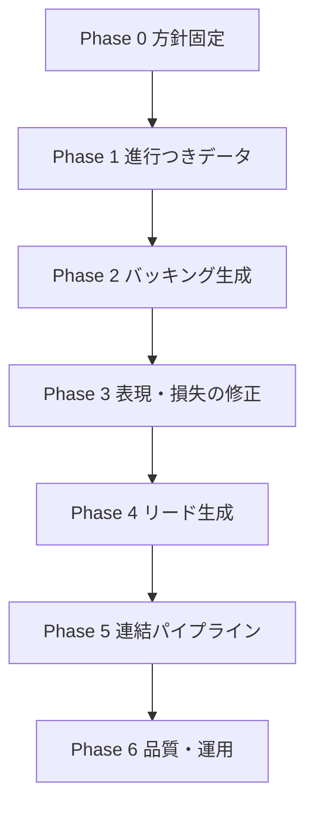

# 現状の課題と解決順序

> 更新: 2026-07-18  
> 前提: 本線は **元 MIDI の改変** から **進行＋メロディによる生成** へ移行済み。  
> **進捗:** 進行つき合成 6,000 本を再生成し、`generate_backing` / `generate_lead` / `generate_song`（backing+lead の2トラック統合）まで実装済み（Phase 1〜5 が一巡）。  
> **現在の本線（2026-08-01）:** リード表現を先に改善。2小節モチーフ・可変音価・息継ぎ・一部power chordを学習し、その後ギターソロへ進む。

関連: [implementation-roadmap.md](./implementation-roadmap.md) §10-7・§11・§12 / [データ/データセット.md](./データ/データセット.md)

---

## 1. 現状の整理（できていること／できていないこと）

| できている | できていない |
|---|---|
| 骨格からノートを追加する | 発音(1)と持続(2)の安定した使い分け |
| ギター音域・ある程度の密度 | キー／メジャースケール・マイナースケールの明示的な制御 |
| 進行を意識した生成（進行→骨格→生成） | リード表現の強化（据え置き中） |
| バッキング／リードの役割分担・2トラック統合 | ギターソロ（強いフレーズ）の生成 |
| 進行＋骨格条件からの生成（元MIDI不要） | 8小節を超える長尺・曲構成 |

---

## 2. 課題一覧

| ID | 課題 | 症状 | 主な原因 | 状態 |
|---|---|---|---|---|
| **H1** | 進行が学習データにない | 音は増えるが和声の流れがない | 合成が1コード反復中心 | ✅ 進行つき合成6,000本で対応 |
| **H2** | 同じ音の連続による勘違い | 打ち直し過多／伸ばしすぎ／休符がない | 反復データ + 0/1/2 を MSE で一括学習 | ⏳ 未対応（Phase 3） |
| **H3** | 推論が「元 MIDI 改変」型 | 進行を基にした生成にならない | 入力がフル曲前提 | ✅ `generate_backing` で進行生成に移行 |
| **H4** | バッキングとリードが未分離 | 役割が混ざった出力 | 1タスク・1トラック学習 | ✅ backing/lead 分離・`generate_song` 統合 |
| **H5** | 損失が和声・onset を見ない | コード外・偽アタックが残りやすい | weighted MSE のみ | ⏳ 未対応（Phase 3） |
| **H6** | パッチ境界・BPM | 流れが切れる／テンポがずれる | 8小節独立・テンポ未引き継ぎ | ⏳ BPMは共通化。長尺・境界は未対応 |
| **H7** | 実データが技法寄り | 進行フレーズ感が弱い | TECHS に練習曲が多い | ⏳ 保留（Stage2不使用で回避中） |
| **H8** | スケール（長調／短調等）未制御 | キー感が弱い・スケール外音が散る | キー／モードを条件にしていない。合成スケールは練習往復のみ | ⏳ 未対応（Phase 3/4） |
| **H9** | ギターソロ（強いフレーズ）未対応 | 技巧的なソロが作れない | ソロ役割・データ・モデルが未定義 | ⏸ lead改善後。power chord率20%方針 |

**本線の目標:** キー＋モード＋進行骨格 → バッキング生成 →（区間に応じて）リード or ギターソロ生成 → 複数トラック MIDI

### 補足: 進行・スケール・コードの関係

```
キー + モード（例: C major / A natural minor）
  → 使える音集合（スケール）
  → その上のコード進行（丸サ等）
  → バッキングは主にコードトーン
  → リードはスケール音＋強拍はコードトーン
```

スケールは進行の親集合。進行だけ学んでも「どの調の音階か」が曖昧だと、リードで特に破綻しやすい。

---

## 3. 解決の順序（推奨）

前の段階が次の前提になるように並べています。



### Phase 0 — 方針固定（実装ほぼなし）

| 項目 | 内容 |
|---|---|
| 決めること | 本線は **進行＋メロディ生成**。元 MIDI 変換は検証用に残す |
| 解決する課題 | 方針のブレ（H3 の前提） |
| 完了条件 | チーム内で「推論のデフォルト入力 = 進行／メロディ骨格」と合意 |

### Phase 1 — 進行つき合成データ（最優先）＋キー／モード明示

| 項目 | 内容 |
|---|---|
| やること | `makeData` に丸サ・小室・カノン等。**各曲に key + mode を付与**し、進行はその調のダイアトニックで生成 |
| 解決する課題 | **H1**（主）、**H8**（データ側の土台）、H2・H7 の一部 |
| 学習 | Colab で `downbeat_chord` の Stage 1 を進行データ中心に再実行 |
| 完了条件 | 進行が変わる MIDI が数千本規模。manifest に `key` / `mode`。骨格ペアで Stage 1 が回る |
| スケール対応 | バッキング target は主にコードトーン。スケール外をわざと混ぜない（ブルーノート等は後で） |

### Phase 2 — バッキング専用の学習と推論入口

| 項目 | 内容 |
|---|---|
| やること | バッキング用 checkpoint。CLI: 進行指定 → 骨格 MIDI → 生成 |
| 解決する課題 | **H3**、**H4**（バッキング側） |
| 完了条件 | 「丸サ骨格 → Rhythm ギター」が DAW で進行として聴ける |
| **実装状況（2026-07-18）** | `generate_backing.py` / `progression_input.py` で **進行→骨格→バッキング生成** を実装済み。品質は進行データでの再学習後に向上 |

### Phase 3 — 同じ音の勘違いを減らす（表現・損失）＋スケール制約の芽

| 項目 | 内容 |
|---|---|
| やること | onset / sustain の損失分離。休符・リズム多様性。必要なら偽アタック抑制 |
| スケール | **ソフト制約:** スケール外ピッチに追加損失（または推論時マスクの試作） |
| 解決する課題 | **H2**、**H5**、**H8**（制約側） |
| 完了条件 | 連続する同一音の不自然な打ち直しが減る。スケール外音が目に見えて減る |

※ Phase 2 の後に入れるのは、進行データなしで損失だけ変えても効果が限定的なため。

### Phase 4 — リード専用（スケール本命）

| 項目 | 内容 |
|---|---|
| やること | `melody_line`／スケール上のメロディ骨格でリード学習。user の Lead 等を活用 |
| スケール | 合成リードは **指定 key/mode のスケール音** で生成。強拍はコードトーン寄り |
| 解決する課題 | **H4**（リード側）、**H8**（メロディ側の本丸） |
| 完了条件 | 「C major で」と指定したとき、ラインがおおむねそのスケールに収まる |
| **実装状況（再学習待ち）** | 2小節モチーフ・可変音価・息継ぎへ変更。フレーズ40%でpower chord候補。backing power attack maskを13ch目に渡して同時attackを避ける。20 epoch新規学習予定 |

### Phase 5 — 連結（キー＋進行＋メロディ生成パイプライン）

| 項目 | 内容 |
|---|---|
| やること | **key/mode + 進行** → バッキング → メロディ骨格 → リード → 2trk 書き出し |
| 解決する課題 | H3・H4・H8 の統合。最終デモ形 |
| 完了条件 | 元フル MIDI なしで、「C major・丸サ・簡易メロディ」から2パート生成できる |

**実装状況（済）**: `prttype/generate_song.py` を実装。同一の進行／キー／BPM／小節数を
`generate_backing` と `generate_lead`（ともにoverdrive）へ渡して1ファイルへ統合する。
新13ch leadでは、先に生成したbackingのpower chord attack時刻をlead条件へ渡す。

- 実行例: `python generate_song.py --progression marusa --key C --bars 8 --bpm 120`
- `--no-lead` / `--no-backing` で片パートのみ、`--lead-onset-th` でリード密度を調整。
- checkpoint は `checkpoints/backing/unet_last.pt` と `checkpoints/lead/unet_last.pt` を使用。
- 残課題: BPM は 2 パートで共通化済み。テンポ／キー変化や骨格メロディ入力（`melody_line`）連携は未対応。

### Phase 6 — 品質・運用（並行・後追い可）

| 項目 | 内容 | 課題 |
|---|---|---|
| BPM パススルー | 入力／指定テンポを出力へ | H6 |
| パッチ重複の整理 | dedupe・窓戦略の見直し | H6 |
| TECHS の選別 | chords / music を厚く、単音練習を抑制 | H7 |
| 検証分離 | P3_music 等を val に温存 | 評価全般 |
| 和声ペナルティ | コード外音の追加重み（任意） | H5 の強化 |

---

## 4. 順序の理由（短く）

| なぜこの順か | 説明 |
|---|---|
| データ（進行）が先 | 損失やモデルをいじっても、正解が単調なら進行は出ない |
| バッキングがリードより先 | 進行意識の本体は伴奏側 |
| 損失改善はデータ直後 | 同じ音の勘違いを、進行学習とセットで潰す |
| 連結は両モデルの後 | パイプラインだけ先に作っても中身が空 |
| BPM 等は後追い可 | 聴感の邪魔にはなるが、生成タスクの本質ではない |

---

## 5. 今やらない／後回し

| 項目 | 理由 |
|---|---|
| POP909 を Stage 2 本線に入れる | ピアノ語彙。進行制御の本命ではない |
| 元 MIDI 改変の精度追求 | 本線から外す |
| 文入力（Phase 7） | キー＋進行＋メロディ生成が安定してから |
| 1モデルで Lead+Rhythm 同時出力 | まず2系統で役割を確立してから |
| U-Net アーキ変更 | 課題の本体はデータとタスク定義 |
| 最初からモード条件の FiLM 等 | まずデータでキー／モードを一貫させ、必要なら後で conditioning |
| 最初からペンタ・ブルーノート多用 | まず major / natural minor のダイアトニックを安定させてから |

---

## 6. 直近の3ステップ（実行用・2026-07-18 更新）

Phase 1〜5は一巡済み。現在はユーザー試聴結果を受け、**リード表現の再学習**を先行する。

1. backing合成をattack単位でpower chord 70%へ再生成し、20 epochで新規学習
2. lead 13ch pairsを再生成し、旧12ch checkpointからresumeせず20 epoch新規学習
3. 同時attack衝突率・フレーズ密度・聴感を確認後、solo（power chord 20%）へ進む

長尺構成レイヤv1は実装済みだが、演奏トラックの品質改善中は据え置く。

---

## 7. 課題 ID と Phase の対応表

| 課題 | Phase 0 | 1 | 2 | 3 | 4 | 5 | 6 |
|---|:---:|:---:|:---:|:---:|:---:|:---:|:---:|
| H1 進行データなし | | ★ | | | | | |
| H2 同じ音の勘違い | | ○ | | ★ | | | |
| H3 元MIDI改変型 | ★ | | ★ | | | ★ | |
| H4 役割未分離 | | | ★ | | ★ | ★ | |
| H5 損失が弱い | | | | ★ | | | ○ |
| H6 パッチ境界・BPM | | | | | | | ★ |
| H7 実データ偏り | | ○ | | | ○ | | ★ |
| H8 スケール未制御 | | ★ | ○ | ○ | ★ | ★ | |

★ = 主担当 / ○ = 副次的に改善

---

## 8. スケール対応の詳細方針

### 8-1. 役割ごとのスケールの効かせ方

| パート | スケールの使い方 |
|---|---|
| **バッキング** | 進行のコードトーンが主。キー／モードは「どのダイアトニック進行か」を決める |
| **リード** | スケール音でラインを作る。強拍・フレーズの着地はコードトーン寄り |

### 8-2. 対応レイヤ（推奨順）

| 順 | レイヤ | 内容 | いつ |
|---|---|---|---|
| 1 | **データ** | 全合成曲に `key` / `mode`。進行・リードをそのスケール内で生成 | Phase 1 / 4 |
| 2 | **推論入力** | ユーザーがキー＋モード＋進行を指定。骨格 MIDI もその調で作る | Phase 2 / 5 |
| 3 | **ソフト制約** | 損失でスケール外を弱く罰する／推論でスケールマスク | Phase 3 |
| 4 | **ハード制約（任意）** | 推論時にスケール外ピッチをゼロ化（聴感確認用） | Phase 3〜5 |
| 5 | **明示 conditioning（任意）** | key/mode embedding を U-Net に注入 | Phase 6 以降 |

最初からモデルにスケールを「教え込む特殊層」より、**データと入力でキーを一貫させる**方が今の U-Net には合う。

### 8-3. 既存 `makeData` のスケールとの違い

| 現状の `scale_up/down` | 目指すスケール意識 |
|---|---|
| 音階の機械的上下（練習） | キーを固定した **進行＋メロディ** |
| 進行と無関係になりやすい | 同じ key/mode の上で伴奏とリードが噛み合う |

スケール往復パターン単体の増量では不十分。**調を共有した進行データ**が本体。

### 8-4. モードの初期セット

| 優先 | モード | 理由 |
|---|---|---|
| ★★★ | major | 丸サ・王道などと相性が良い |
| ★★★ | natural_minor | 短調の基本 |
| ★★☆ | あとで pentatonic / harmonic_minor | リードの表現用。土台の後 |

### 8-5. 評価の目安

- バッキング: 各小節のピッチ集合が、指定コードのトーンとどの程度一致するか  
- リード: 発音のうちスケール内音の割合（例: 85% 以上を目標にチューニング）  
- 聴感: 同じ進行で major / minor を切り替えたとき、明らかに調が変わるか

---

## 9. リズム未収束問題の原因調査（2026-07-18）

「バッキングが 1 小節 1 発になる／リズムが出ない」件を切り分けた結果、**モデルではなく学習設定の問題**と判明した。

### 9-1. 診断の流れ（3段階）

| 実験 | 結果 | 解釈 |
|---|---|---|
| 本番CKPTに4分刻み入力 | 出力ほぼ全ゼロ＋ノイズ散乱 | リズム未学習 |
| pos_weight 10→200 | 改善せず | 重み単独の問題ではない |
| **1パッチ overfit(lr=1e-3, 500ep)** | **onset を完全再現** | モデル・表現・損失は正常 |

- 途中、評価コードが onset 位置を取り違え（正: 0,4,8,12／sustain を誤カウント）て「にじみが原因」と誤結論 → 撤回済み。
- 正しい評価軸（onset=値1・sustain=値2、pitch 込みの precision/recall）で本番CKPTを測ると precision 4〜24%＝未収束。

### 9-2. 真の原因

1. **学習不足**: 本番CKPT は `lr=1e-5 × 20ep`。overfit で収束した `lr=1e-3` の 1/100。
2. **`--resume` 未実装**: Colab の Stage2 は `--resume` を渡していたが `train.py` に未実装で、**Stage1 を引き継がずゼロ初期化から `lr=1e-5×20ep`** で学習していた → ほぼ未学習の重みが出力されていた。
3. **推論の入力モード不整合**: `generate_backing.py` が `input_mode="full"`（precision 4%）。学習時の `downbeat_chord` と不一致。

### 9-3. 対応（実施済み）

| 対象 | 変更 |
|---|---|
| `train.py` | `--resume` を実装（既存 CKPT の重みを読み込んで継続） |
| `generate_backing.py` | 推論 `input_mode` を `full` → `downbeat_chord`（学習と一致） |
| `colab_train.ipynb` | Stage1 `epochs 20→80` / `lr=1e-3` 明示、Stage2 `lr 1e-5→1e-4` / `--resume` 前提、`pos_weight 10→20` |

### 9-4. 結論

- 「学習データのリズム多様化」「onset/sustain チャンネル分離」などの改修は**まだ不要**。まず上記設定で再学習すれば、現在のデータ・モデルでリズムは出るはず。
- リズムの**明示制御**（4回/8回を指定）が欲しくなった段階で、条件付け（key/mode/rhythm embedding 等）を Phase 6 で検討する。

### 9-5. 再学習後の検証結果（2026-07-18）

| CKPT | onset precision | marusa 生成音数 | onset 位置 | 判定 |
|---|---|---|---|---|
| Stage2版(resume+lr1e-4×30ep) | 22% | 33 | 全位置に散乱 | ✗ 刻めない |
| **Stage1単体(80ep, lr1e-3)** | **76.5%** | **96** | **各拍に規則的(1,5,9,13)** | ✓ 4分刻みが出る |

- **原因(B)が確定**: Stage2（Guitar-TECHS微調整, lr1e-4×30ep）が Stage1 で学んだ4分刻みを崩していた。
- **対応**: backing には **Stage1（合成データのみ）** を採用。`checkpoints/backing/` に配置。
- Stage2 は当面不使用。使うなら `lr=1e-5・数ep` に留めてリズムを崩さないか要検証。
- 残課題: recall（発音の網羅率）はまだ伸びしろあり。epoch 追加や推論しきい値の調整で改善余地。スケール外音（稀に半音）の抑制は H8 で対応。
