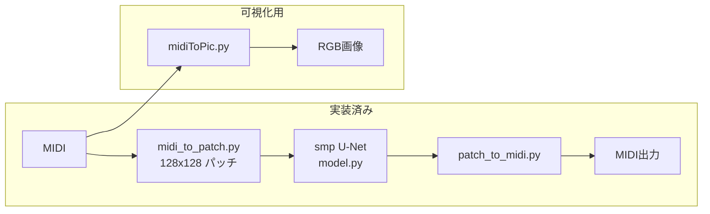

# 研究プロトタイプ 概要（スライド用まとめ）

> MIDI を ViTex 互換の画像パッチに変換し、segmentation-models-pytorch（smp）の U-Net で処理するパイプラインの現状整理。  
> 最終目標：**特徴的なギターフレーズを生成できる AI** の構築。

---

## 1. 研究の目的

- MIDI データを **独自の画像フォーマット**（ViTex ベース）に変換する
- **既存の画像処理 AI**（smp U-Net）と組み合わせて音楽生成・変換を行う
- 特に **ギターの特徴的なフレーズ生成** を目指す

---

## 2. システム構成（現状）



| ファイル | 役割 |
|---|---|
| `midiToPic.py` | MIDI → RGB 可視化画像（人間が見る用） |
| `midi_to_patch.py` | MIDI → ViTex 互換パッチ `(11, 128, 128)` |
| `model.py` | smp U-Net（ResNet18 エンコーダ） |
| `dataset.py` / `train.py` | 学習データ読み込み・学習 |
| `inference.py` | MIDI → パッチ → U-Net → MIDI |
| `patch_to_midi.py` | パッチ → MIDI 逆変換 |

**パッチの意味**

| 軸 | 内容 |
|---|---|
| サイズ | 128 × 128（8 小節分） |
| チャンネル | 11（楽器カテゴリ）+ ドラム |
| ピクセル値 | 0=無音 / 1=音符開始 / 2=持続 |

---

## 3. 今やれること ✅

### 3-1. MIDI の変換・可視化

- MIDI を **RGB ピアノロール画像**に変換（`midiToPic.py`）
- MIDI を **ViTex 互換の固定パッチ**に変換（`midi_to_patch.py`）
- 例：`test1.mid` → **34 パッチ**を `.npy` として保存

### 3-2. パイプラインの往復変換

- **MIDI → パッチ → MIDI** の往復が可能（`patch_to_midi.py`）
- 音符のおおまかな構造（音高・タイミング）は保持できる

### 3-3. U-Net の組み込み・学習の雛形

- smp U-Net の forward が動作（`smoke_test_smp.py`）
- **1 パッチの過学習テスト**が可能（`train.py --overfit-single`）
- チェックポイントの保存・読み込みが可能

### 3-4. 推論パイプライン

- `MIDI → パッチ → U-Net → MIDI` の一連処理（`inference.py`）
- モデルなしの往復確認（`--identity` オプション）

---

## 4. まだやれないこと ❌

| 項目 | 理由 |
|---|---|
| **特徴的なギターフレーズの生成** | ギター特化の学習データが未整備 |
| **意味のある音楽変換**（編曲・和声付けなど） | 入力/正解のペアデータがない |
| **実用レベルの生成品質** | 本学習済みモデルがない（過学習テストのみ） |
| **ドラムの U-Net 変換** | 推論時はドラムを入力のままコピー |
| **MP3 からの直接入力** | 音声→MIDI（自動採譜）の前処理が未実装 |
| **ViTex 本家と同等の生成** | ViTex の DualUNet + D3PM は未統合 |
| **ImageNet 事前学習の利用** | オフライン環境では重みダウンロード不可 |

---

## 5. 開発の進捗ステージ

```
[完了] 形式変換・モデル組み込み・学習/推論の雛形
   ↓
[現在] 学習データセットの収集・選別
   ↓
[これから] 本学習 → ギターフレーズ生成の評価
```

**一言で言うと**  
「パイプラインの骨組みは動くが、**音楽的に価値のある出力をするためのデータと学習がこれから**」という段階。

---

## 6. 今後必要なこと

### 6-1. 学習データの用意（最優先）

| 必要なもの | 内容 |
|---|---|
| **入力パッチ** | 変換前の MIDI から生成 |
| **正解パッチ** | 望ましい出力 MIDI から生成 |
| **データ量の目安** | まず 100〜200 フレーズで試験 → 500〜2,000 でプロトタイプ → 3,000〜10,000 で特徴の抽出 |

### 6-2. データ前処理

- ギター系トラックのみ抽出（General MIDI program 24〜31）
- ギターの音符がほとんどないパッチの除外
- 必要に応じて JAMS → MIDI 変換（GuitarSet 用）

### 6-3. 本学習・評価

- 入力/正解ペアでの `train.py` 本実行
- 生成 MIDI の聴取評価
- 損失・品質の改善（エポック数、データ拡張など）

### 6-4. 環境面（任意）

- GPU 環境の整備（CPU でも動くが学習は遅い）
- ImageNet 事前学習重みの利用（`--encoder-weights imagenet`）
- Guitar-TECHS 等のデータ取り込みスクリプト

---

## 7. データセット収集について（現在取り組み中）

### 7-1. 方針

- **MP3 → MIDI は使わない**（情報が失われるため）
- **MIDI を直接集める**ことを優先
- 最初は **1 スタイルに絞る**（例：ロック / メタル / ブルース）
- **質の高いデータ**を量より重視

### 7-2. 候補データセット

| データセット | MIDI の形式 | 優先度 | 備考 |
|---|---|---|---|
| **[Guitar-TECHS](https://zenodo.org/records/14963133)** | `.mid` あり（弦ごと 6 トラック） | ★★★ | そのまま使いやすい。エレキギター |
| **[GuitarSet](https://zenodo.org/records/3371780)** | JAMS（要変換） | ★★☆ | 質が高い。360 エクセプト |
| **[SynthTab](https://synthtab.dev/)** | MIDI あり（大規模） | ★★☆ | 数万曲規模。合成データ |
| **[Lakh MIDI](https://www.colinraffel.com/projects/lmd/)** | `.mid` あり | ★☆☆ | 17 万曲。ギター絞り込みが必要 |
| **[BitMidi](https://bitmidi.com/)** | `.mid` あり | ★☆☆ | 手動収集向け。品質はバラバラ |

### 7-3. Zenodo の MIDI の有無

| データセット | MIDI |
|---|---|
| Guitar-TECHS | ✅ zip 内に MIDI あり |
| GuitarSet | △ JAMS 形式（変換が必要） |
| EGSet12 | ❌ 音声（WAV）のみ |

### 7-4. 収集の段階的プラン

| 段階 | データ量 | 目的 |
|---|---|---|
| Phase 1 | 100〜200 フレーズ | 学習が回るか確認 |
| Phase 2 | 500〜1,000 フレーズ | 「ギターらしさ」が出るか評価 |
| Phase 3 | 3,000〜10,000 フレーズ | 特徴的なフレーズ生成を目指す |

---

## 8. スライド構成案（そのまま使える目次）

1. **研究目的** — 特徴的なギターフレーズ生成 AI
2. **アプローチ** — MIDI → 画像パッチ → U-Net → MIDI
3. **システム構成図** — 各モジュールの役割
4. **実装済みの機能** — 変換・学習雛形・推論パイプライン
5. **現状の限界** — 本学習データ未整備、生成品質は未達
6. **開発ステージ** — パイプライン完了 → データ収集中
7. **データセット戦略** — Guitar-TECHS 優先、段階的に拡張
8. **今後の予定** — データ整備 → 本学習 → 評価

---

## 9. まとめ（スライド最終ページ用）

- **できていること**：MIDI と画像パッチの相互変換、smp U-Net の組み込み、学習・推論の土台
- **できていないこと**：ギター特化の意味ある音楽生成（データ不足）
- **今やっていること**：ギター MIDI データセットの調査・収集
- **次のマイルストーン**：Guitar-TECHS 等からデータを取り込み、最初の本学習を実行

---

## 参考リンク

- 技術プラン詳細：[smp-unet-plan.md](./smp-unet-plan.md)
- 実装ディレクトリ：`prttype/`
- ViTex 参考実装：`vitex/ViTex/`
