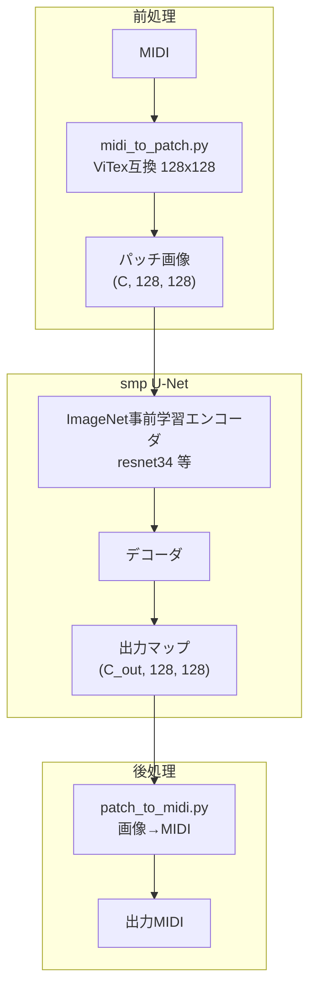

# segmentation-models-pytorch U-Net 導入計画

## 現状の整理


- [prttype/midiToPic.py](../prttype/midiToPic.py): MIDI → 高さ128・**幅可変**の RGB 画像（R/G/B = メロディ/伴奏/ベース）
- [vitex/ViTex](../vitex/ViTex): 独自の **DualUNet + D3PM**（拡散モデル）。入力は **128×128 固定パッチ**、11 楽器チャンネル + ドラム、値は 0/1/2（無音/オンセット/持続）
- venv には **PyTorch 2.12 (CPU)** のみ。`segmentation-models-pytorch` は未インストール

**重要なギャップ**: 現在の `midiToPic.py` の出力は smp U-Net にそのまま載せにくいです。

| 項目 | 現在の midiToPic | ViTex / smp 向け |
|---|---|---|
| サイズ | 128 × 可変（秒ベース） | **128 × 128 固定** |
| チャンネル | RGB 3ch | **11ch（楽器）+ 1ch（ドラム）** |
| 時間軸 | 連続秒 | **8小節 = 128 tick**（resolution 4） |
| ピクセル値 | 0 or 128 | **0 / 1 / 2**（音符状態） |

smp の U-Net は自然画像用エンコーダ（ResNet 等）を前提としており、**固定サイズのテンソル** `(B, C, H, W)` で動かすのが基本です。

---

## 目標アーキテクチャ



**役割の定義**: smp U-Net は「入力パッチ画像 → 出力パッチ画像」の **ピクセル単位変換**（セグメンテーション/画像変換）を担います。ViTex の DualUNet を置き換えるのではなく、**既存の画像 AI エコシステムを活用する層**として位置づけます。

---

## Phase 1: 環境構築

venv に以下を追加インストール:

```powershell
.\venv\Scripts\pip install segmentation-models-pytorch torchvision muspy
```

最小動作確認（`prttype/smoke_test_smp.py`）:

```python
import segmentation_models_pytorch as smp
model = smp.Unet(encoder_name="resnet34", encoder_weights="imagenet",
                 in_channels=11, classes=11)
# ダミー入力 (1, 11, 128, 128) で forward が通ることを確認
```

**注意**: 現在の venv は **CPU 版 PyTorch** のため、学習は動くが遅い。GPU があれば CUDA 版への切り替えを検討。

---

## Phase 2: MIDI → ViTex 互換パッチ変換

[vitex/ViTex/data_preprocess/processor.py](../vitex/ViTex/data_preprocess/processor.py) のロジックを参考に、`prttype` に軽量版コンバータを追加します。

**ファイル**: `prttype/midi_to_patch.py`

- `muspy` で MIDI を resolution=4 に正規化（ViTex と同じ tick 基準）
- 曲を **8 小節（128 tick）単位**でスライス
- 各パッチを `(11, 128, 128)` の tonal pianoroll に変換
  - チャンネル = `program // 8`（最大 10、ViTex 準拠）
  - 値: 0=無音, 1=オンセット, 2=持続
- オプションでドラム `(1, 128, 128)` も別出力
- 既存 [midiToPic.py](../prttype/midiToPic.py) は「可視化用」として残し、学習用はパッチ形式を使う

---

## Phase 3: smp U-Net モデル定義

**ファイル**: `prttype/model.py`

```python
import segmentation_models_pytorch as smp

def build_unet(in_channels=11, out_channels=11, encoder="resnet34"):
    return smp.Unet(
        encoder_name=encoder,
        encoder_weights="imagenet",
        in_channels=in_channels,
        classes=out_channels,
        activation=None,
    )
```

最初のプロトタイプは **11ch 入出力・MSE 損失**（ViTex の 0/1/2 値を 0.0/0.5/1.0 に正規化）。

---

## Phase 4: データセットと学習

**ファイル**: `prttype/dataset.py`, `prttype/train.py`

### 必要な学習データ

1. **入力画像パッチ** `(11, 128, 128)` … 変換したい元の MIDI
2. **正解画像パッチ** `(11, 128, 128)` … 望ましい出力 MIDI
3. **ペア数**: 数百〜数千パッチ（曲数 × パッチ数）

データが未整備の場合:

1. **スモークテスト**: 同一画像を入出力にした過学習（1 パッチで loss→0 を確認）
2. **自己教師あり**: 入力画像にマスク（ランダム欠損）→ 元画像を復元
3. **本学習**: ペアデータが揃ってから本格的に学習

---

## Phase 5: 推論パイプライン

**ファイル**: `prttype/inference.py`

1. MIDI → パッチ列に分割（`midi_to_patch.py`）
2. 各パッチを smp U-Net に通す
3. 出力パッチを結合（`patch_to_midi.py`）
4. 閾値処理で 0/1/2 に戻す
5. `muspy` で MIDI 保存

---

## 推奨ディレクトリ構成

```
prttype/
  midiToPic.py          # 既存（可視化用）
  midi_to_patch.py      # ViTex互換パッチ変換
  patch_to_midi.py      # パッチ→MIDI逆変換
  model.py              # smp U-Net 定義
  dataset.py            # Dataset / DataLoader
  train.py              # 学習スクリプト
  inference.py          # 推論スクリプト
  smoke_test_smp.py     # 動作確認
  data/patches/         # 変換済みパッチ
  checkpoints/          # 学習済み重み
  midi/                 # テスト MIDI
```

---

## ViTex との関係

| 選択肢 | 内容 |
|---|---|
| **A. 独立プロトタイプ（推奨）** | `prttype` で smp U-Net を完結。ViTex の pkl 前処理だけ借りる |
| **B. ViTex 置き換え** | DualUNet の代わりに smp を差し込む。D3PM 拡散部分との整合が必要で工数大 |
| **C. ハイブリッド** | ViTex で生成 → smp で後処理 |

今回は **A** を採用。

---

## 実装の優先順位

1. `pip install segmentation-models-pytorch` + スモークテスト
2. `midi_to_patch.py` で `test1.mid` → `(11, 128, 128)` パッチ出力
3. `model.py` + 1 パッチ過学習でパイプライン確認
4. `patch_to_midi.py` で往復変換の検証
5. `dataset.py` / `train.py` / `inference.py` を本実装

---

## 実装状況（完了）

以下のファイルが `prttype/` に追加済みです。

| ファイル | 役割 |
|---|---|
| `midi_to_patch.py` | MIDI → ViTex 互換パッチ `(11, 128, 128)` |
| `patch_to_midi.py` | パッチ → MIDI 逆変換 |
| `model.py` | smp U-Net 定義 |
| `dataset.py` | Dataset / DataLoader |
| `train.py` | 学習スクリプト |
| `inference.py` | 推論パイプライン |
| `smoke_test_smp.py` | forward 動作確認 |
| `requirements.txt` | 依存パッケージ |

## 使い方

プロジェクトルート（`研究/`）で venv を有効化したうえで実行します。

```powershell
cd prttype

# 1. smp U-Net の動作確認
..\venv\Scripts\python.exe smoke_test_smp.py

# 2. MIDI → パッチ変換
..\venv\Scripts\python.exe midi_to_patch.py

# 3. パッチ → MIDI 往復変換
..\venv\Scripts\python.exe patch_to_midi.py

# 4. 1 パッチ過学習（パイプライン確認）
..\venv\Scripts\python.exe train.py --overfit-single --epochs 3

# 5. 推論（学習済みチェックポイント使用）
..\venv\Scripts\python.exe inference.py

# モデルなしでパッチをそのまま MIDI に戻す
..\venv\Scripts\python.exe inference.py --identity
```

**注意**: ImageNet 事前学習重みはネットワーク接続が必要です。オフライン時はデフォルト（ランダム初期化）で動作します。接続がある場合は `--encoder-weights imagenet` を `train.py` に付けてください。

## 出力先

- パッチ: `prttype/data/patches/test1/`
- チェックポイント: `prttype/checkpoints/unet_last.pt`
- 生成 MIDI: `prttype/data/test1_inferred.mid`
